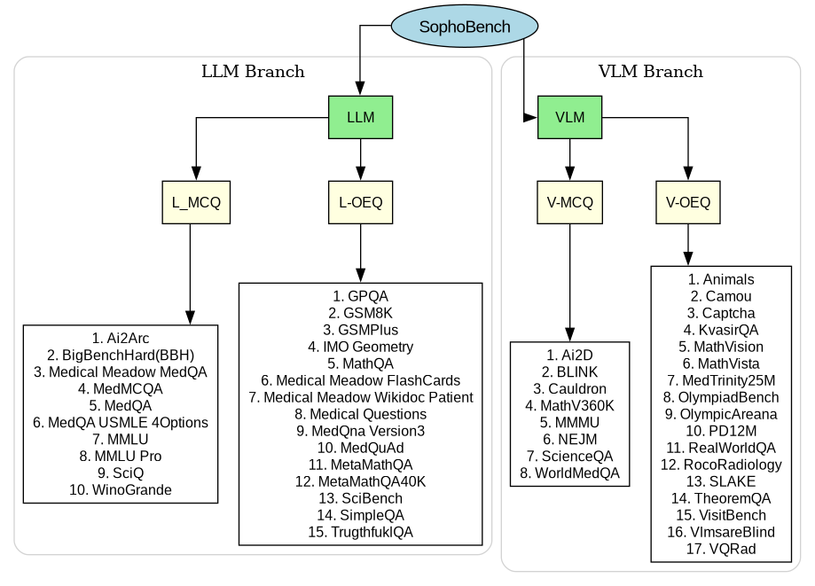

# SophoBench

SophoBench offers a comprehensive suite of datasets designed to evaluate the capabilities of large language models. These datasets are categorized as follows:

- **L-MCQ:** Text-only Multiple-Choice Questions.
- **L-OED:** Text-only Open-Ended Questions.
- **V-MCQ:** Image-based Multiple-Choice Questions with accompanying text.
- **V-OED:** Open-Ended Questions focused on image content.

Each dataset provides a unique challenge, enabling a thorough assessment of both textual and visual understanding.

